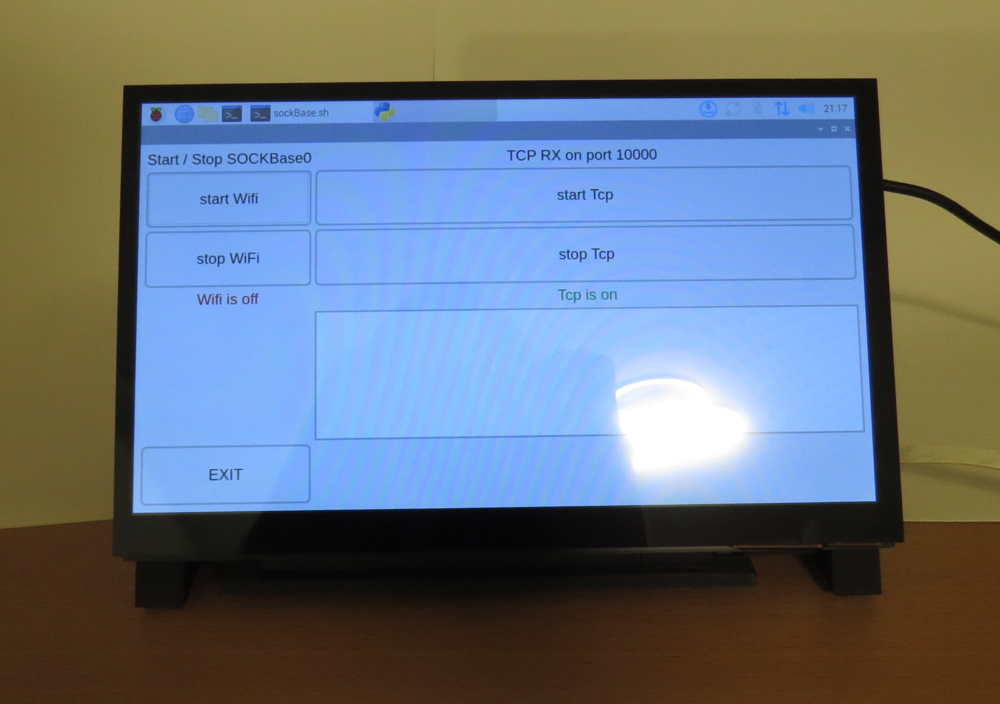
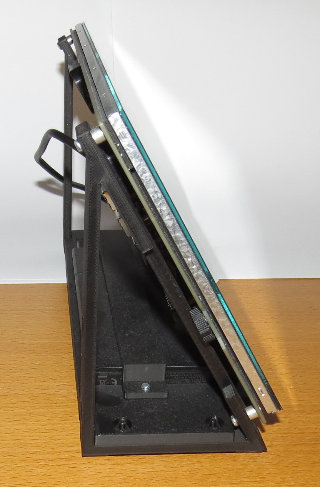

# DisplayBatteryMount
Mounting bracktes for a Lafvin 10" Display and GreenCell Battery \
Mounting bracktes for a Waveshare 10" Display 

Both displays are touch screens and able to carry a Raspberry Pi as a backpack \
Therefore the combination with DisplayBatteryMount components is suited to realise a tablet

## TODO
specify necessary screws
 * 4x M4
 * 4x M3

Add photos of an actual assembly

## Assembled in CAD
{width=50%}

## Assembled in reality
{width=50%} \

{width=25%} {width=25%} \

{width=25%} {width=25%}
